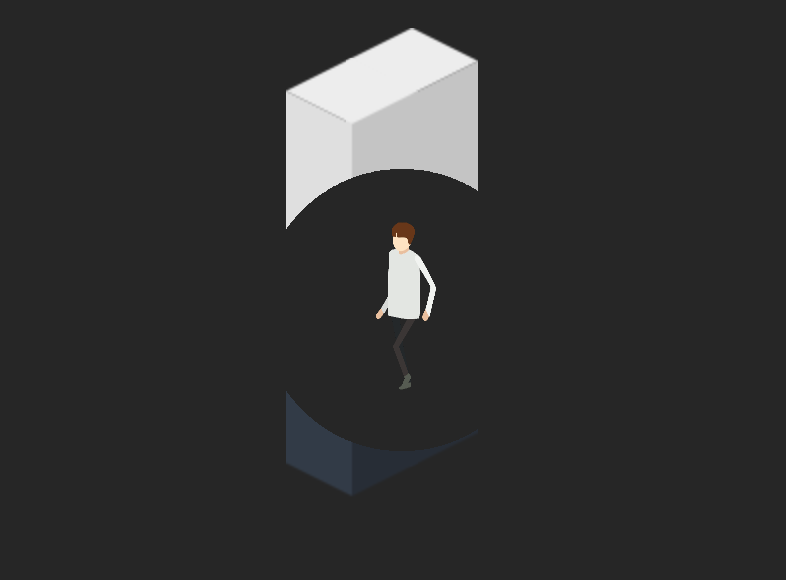

# SpriteKitSeeThrough

[](http://cocoapods.org/pods/SpriteKitSeeThrough)
[](http://cocoapods.org/pods/SpriteKitSeeThrough)
[](http://cocoapods.org/pods/SpriteKitSeeThrough)

## What it is

`InvertedCircleMaskNode` allows you to create a SpriteKit node that can act as an inverted circular mask. It can be used, for example, to be able to allow the player to see behind walls if your character is behind a wall.

This is possible by using an image of a transparent (alpha 0) circle within a rectangle of the size of the scene. Behind the scenes, this little library will pre-generate this image for you given a position and radius so you don't have to create any assets manually.



It's easier to understand if you see for yourself, so try out the included example app.

## Usage

### Setup
```swift
let cropNode = SKCropNode()

for wall in walls { cropNode.addChild(wall) }

let mask = InvertedCircleMaskNode(size: scene.size,
                                  circleCenter: position,
                                  circleRadius: radius)

cropNode.maskNode = mask
```

### Repositioning and resizing
```swift
// Mask position and size
mask.position = CGPoint(...)
mask.rectangleCenter = CGPoint(...)
mask.size = CGSize(...)

// Circle position within mask
mask.circleCenter = CGPoint(...)
```

Note: because rendering the circle is the expensive part, by design there is no inbuilt way to change the radius of the circle on an initialized node. If you want a resizing mask, consider either scaling the node or initializing different sizes upfront.

## Example

To run the example project, clone the repo, and run `pod install` from the Example directory first.

## Installation

SpriteKitSeeThrough is available through [CocoaPods](http://cocoapods.org). To install
it, simply add the following line to your Podfile:

```ruby
pod "SpriteKitSeeThrough"
```

## Author

Daniel Inkpen, dan2552@gmail.com

## License

SpriteKitSeeThrough is available under the MIT license. See the LICENSE file for more info.
